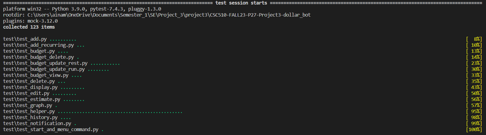
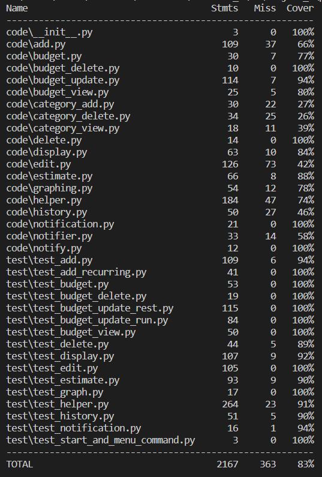

<p align="center"></p>

[](https://opensource.org/licenses/MIT)
[](https://desktop.telegram.org/)

[](https://github.com/ebanigogia/dollar_bot/graphs/contributors)
[](https://doi.org/10.5281/zenodo.10211886)
[](https://app.travis-ci.com/usmanwardag/dollar_bot)

[](https://github.com/ameghana/CSC510-FALL23-P27-Project3-dollar_bot/issues)
[](https://github.com/ameghana/CSC510-FALL23-P27-Project3-dollar_bot/issues?q=is%3Aissue+is%3Aclosed)
[](https://github.com/ameghana/CSC510-FALL23-P27-Project3-dollar_bot/pulls)
[](https://www.python.org)
[](https://github.com/ameghana/CSC510-FALL23-P27-Project3-dollar_bot/discussions)
[](https://github.com/prettier/prettier)
[](https://github.com/ameghana/CSC510-FALL23-P27-Project2/blob/main/docs/SE%20Discord%20Chat%20Screenshot.png)


DollarBot is a user-friendly Telegram Bot designed to simplify the process of recording your daily expenses on a local system. With simple commands and a seamless interface, DollarBot makes managing your finances a hassle-free experience. Whether you want to track your spending, view your expenses, or delete entries, DollarBot offers a simple and efficient solution. Enjoy the convenience of effortlessly recording your expenditures with DollarBot on Telegram.  
With simple commands, this bot allows you to:
- Add/Record new spendings
- Display your spendings through bar graph
- Show the sum of your expenditure for the current day/month
- Display your spending history
- Clear/Erase all your records
- Edit/Change any spending details if you wish to

---

## :rocket: Improvements in Phase-III
- Command to download history of expenses as a csv file
- Added a calender feature to update and edit dates
- Coded a feature to update and delete dates
- Added a feature to easily access the recurring expenses
- Feature to send notification via email
- More than 120 testcases to validate the application
- Detailed testcases
  
---

<p align="center">
  <a href="#movie_camera-checkout-our-video">Checkout our video</a>
  ::
  <a href="#computer-technology-used">Technology Used</a>
  ::
  <a href="#bulb-use-case">Use Case</a>
  ::
  <a href="#page_facing_up-why">Why</a>
  ::
  <a href="#rocket-installation">Installation</a>
  ::
  <a href="#computer-testing">Testing</a>
  ::
  <a href="#rocket-code-coverage">Code Coverage</a>
  ::
  <a href="#page_with_curl-license">License</a>
  ::
  <a href="#page_facing_up-code-documentation">Code Documentation</a>
  ::
  <a href="#how-to-contribute">How to Contribute</a>
  ::
  <a href="#golf-future-roadmap">Future Roadmap</a>
  ::
  <a href="#sparkles-contributors">Contributors</a>
  ::
  <a href="#email-support">Support</a>

</p>

---

## :movie_camera: Checkout our video!


<p align="center"></p>


## :computer: Technology Used

- Python : https://www.python.org
- Shell : https://www.learnshell.org
- HTML : https://html.com

## :bulb: Use Case

- **_Expense Tracking_**: Use DollarBot to record your daily expenses, categorizing them based on your spending habits.Keep track of your spending patterns over time to better understand your financial habits.View summaries and analytics generated by DollarBot to gain insights into your overall spending trends. Identify areas where you can potentially cut costs or reallocate your budget.
- **_Budget Management_**: Set a budget for specific categories (e.g., groceries, entertainment) and use DollarBot to monitor your adherence to those budgets.
Receive notifications when you approach or exceed your predefined budget limits.Receive intelligent notifications from DollarBot, such as reminders to input daily expenses or alerts when you approach your budget limits.
- **_Expense Analysis for Businesses_**: For small businesses, DollarBot can be used to track business-related expenses and analyze spending patterns.
Generate reports to understand where the majority of business funds are allocated.

## :page_facing_up: Why

- DollarBot streamlines the process of recording daily expenses, providing a quick and efficient way to log spending. This efficiency can save you time and effort compared to manual methods. It helps in managing your budget effectively by allowing you to set spending limits for different categories. It provides alerts when you approach or exceed those limits, promoting better financial discipline.
- By using DollarBot, you gain insights into your spending habits and patterns. This increased awareness can lead to more informed financial decisions and a better understanding of where your money goes. Since, it operates on a local system, ensuring the privacy and security of your financial data. This can be particularly important for users who prioritize data confidentiality.
- Small businesses can benefit from DollarBot's expense tracking and reporting capabilities. It offers a simple yet effective tool for monitoring business-related spending. It maintains a history of your recorded expenses, allowing you to analyze past transactions. 


## :rocket: Installation

The below instructions can be followed in order to set-up this bot at your end in a span of few minutes! Let's get started:

## 1. Clone the repository
1. Clone the Github repository to a desired location on your computer. You will need [git](https://git-scm.com/) to be preinstalled on your machine. Once the repository is cloned, you will then `cd` into the local repository.
   
2. Start a terminal session in the directory where the project has been cloned. Run the following command to install the required dependencies:
```
  pip install -r requirements.txt

```
## 2. Install the Telegram desktop application
Make sure that you have Telegram desktop application installed in your system. You can download and install the Telegram desktop application from the following website.
 ```
 https://desktop.telegram.org/
 ```
## 3. Run the application

1. In Telegram, search for "BotFather". Click on "Start", and enter the following command:
```
  /newbot
```
2. Follow the instructions on screen and choose a name for your bot (e.g., `dollarbot`). After this, select a username for your bot that ends with "bot". The username has to be unique. 

3. The BotFather will now confirm the creation of your bot and provide a TOKEN to access the HTTP API - copy and save this token for future use.

4. In the repo directory (where you cloned it), run these commands to (i) grant execution access to a bash script, and (ii) execute that bash script to run the Telegram Bot:
```
   chmod a+x run.sh
   ./run.sh
```
   
(OR)
```
   chmod a+x run.sh
   bash run.sh
```
```Note```: It will ask you to paste the API token you received from Telegram in step 4.
A successful run will generate a message on your terminal that says "TeleBot: Started polling." 

5. In the Telegram app, search for your newly created bot by entering the username and open the same. Now, on Telegram, enter the "/start" or "menu" command, and you are all set to track your expenses!

### Run Automatically at Startup

To run the script automatically at startup / reboot, simply add the `.run_forever.sh` script to your `.bashrc` file, which executes whenever you reboot your system.

## :computer: Testing

We use pytest to perform testing on all unit tests together. The command needs to be run from the home directory of the project. The command is:
```
python run -m pytest test/
```
<p align="center"></p>


## :rocket: Code Coverage

Code coverage is part of the build. Every time new code is pushed to the repository, the build is run, and along with it, code coverage is computed. This can be viewed by selecting the build, and then choosing the codecov pop-up on hover.

Locally, we use the coverage package in python for code coverage. The commands to check code coverage in python are as follows:

```
coverage run -m pytest test/
coverage report
```
<p align="center"></p>

## :page_with_curl: License

This project is licensed under the terms of the MIT license. Please check [License](https://github.com/usmanwardag/dollar_bot/blob/main/LICENSE) for more details.


## :page_facing_up: Code Documentation

Documentation can be accessed anytime via the below link.

`https://github.com/sak007/MyDollarBot-BOTGo/tree/main/docs`

## How to Contribute

We would be happy to receive contributions! If you'd like to, please go through our [CONTRIBUTING.md](https://github.com/ameghana/CSC510-FALL23-P27-Project3-dollar_bot/blob/proj3/CONTRIBUTING.md)

For any feedback, issues, or bug reports, please create an issue [here](https://github.com/ameghana/CSC510-FALL23-P27-Project3-dollar_bot/issues/new?assignees=&labels=&projects=&template=custom.md&title=to-do+).

## :golf: Future RoadMap

-Developing further enhancements to record split expenses
-Build machine learning model to predict the future expenses to estimate the budget
-More interative UI where the bot answers general questions as well

## :sparkles: Contributors

- [Meghana Chowdary Ainampudi](https://github.com/ameghana)
- [Sai Abhigna Tummala](https://github.com/abhigna98)
- [Sravya Karanam](https://github.com/SreeKaranam)
- [Sucharitha Nadendla](https://github.com/Nsucharitha)

## :email: Support

For any queries and help, please reach out to us at: csc510se.p27@gmail.com

## Chat Channel

- https://discord.com/channels/1161405668079698112/1161405668578836530


